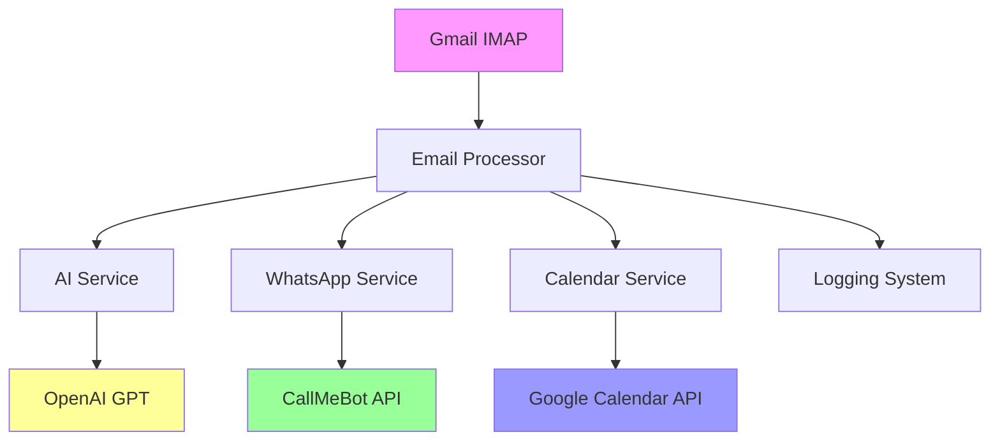

# 📧 Gmail AI Email Processor

[](https://python.org)
[](https://github.com/astral-sh/uv)
[](https://openai.com)
[](LICENSE)

An intelligent email processing system that automatically fetches emails from Gmail, analyzes them using AI, sends WhatsApp notifications, and creates Google Calendar events with duplicate prevention.

## 🚀 Features

- **📨 Gmail Integration**: Secure IMAP access with OAuth2 authentication
- **🤖 AI-Powered Analysis**: Uses OpenAI GPT models to extract events, dates, and summaries
- **📱 WhatsApp Notifications**: Smart notifications via CallMeBot API
- **📅 Calendar Management**: Automatic Google Calendar event creation with duplicate prevention
- **🏗️ Modular Architecture**: Clean, maintainable code structure
- **⚡ Modern Dependencies**: UV package manager for fast, reliable dependency management
- **📊 Comprehensive Logging**: Detailed logging and error handling
- **🎯 Smart Filtering**: Process emails from specific domains only

## 🏗️ Architecture



## 📋 Prerequisites

- Python 3.11+
- Gmail account with 2FA and app password
- Google Cloud Console project with Calendar API enabled
- OpenAI API key
- CallMeBot WhatsApp setup

## ⚡ Quick Start

### 1. Install UV Package Manager

```bash
# Windows (PowerShell)
powershell -ExecutionPolicy ByPass -c "irm https://astral.sh/uv/install.ps1 | iex"

# macOS/Linux
curl -LsSf https://astral.sh/uv/install.sh | sh
```

### 2. Clone and Setup

```bash
git clone https://github.com/YOUR_USERNAME/gmail-ai-processor.git
cd gmail-ai-processor

# Install dependencies
uv sync

# Install with dev dependencies (optional)
uv sync --extra dev
```

### 3. Configure Environment

```bash
# Copy environment template
cp .env.example .env

# Edit .env with your credentials
# Also download credentials.json from Google Cloud Console
```

### 4. Run the Processor

```bash
# Using UV (recommended)
uv run python main.py

# Or with tasks
uv run --extra dev python main.py
```

## 🔧 Configuration

### Environment Variables (`.env`)

```bash
# Gmail IMAP Configuration
GMAIL_USER=your_email@gmail.com
GMAIL_APP_PASSWORD=your_16_char_app_password

# OpenAI Configuration
OPENAI_API_KEY=sk-your_openai_api_key

# WhatsApp Configuration (CallMeBot)
CALLMEBOT_API_KEY=your_callmebot_api_key
CALLMEBOT_PHONE=65123456789

# Domain Filter
DOMAIN_FILTER=@yourdomain.com

# Google Calendar (place credentials.json in project root)
GOOGLE_CALENDAR_CREDENTIALS_FILE=credentials.json
GOOGLE_CALENDAR_TOKEN_FILE=token.json
```

### Required Files

1. **`.env`** - Copy from `.env.example` and fill in your credentials
2. **`credentials.json`** - Download from Google Cloud Console (Calendar API)

## 📁 Project Structure

```
gmail-ai-processor/
├── 📄 main.py                 # Entry point
├── 📄 email_processor.py      # Main orchestrator
├── 📄 config.py              # Configuration management
├── 📁 services/              # Modular services
│   ├── 📄 email_service.py    # Gmail IMAP integration
│   ├── 📄 ai_service.py       # OpenAI GPT integration
│   ├── 📄 whatsapp_service.py # WhatsApp notifications
│   └── 📄 calendar_service.py # Google Calendar with duplicates prevention
├── 📄 pyproject.toml         # UV configuration
├── 📄 uv.lock               # Dependency lock file
├── 📄 .env.example          # Environment template
├── 📄 .gitignore            # Git ignore rules
└── 📁 docs/                 # Documentation and diagrams
    ├── 📄 architecture_diagram.puml
    ├── 📄 sequence_diagram.puml
    └── 📄 UV_SETUP.md
```

## 🎯 Key Features Explained

### 🤖 AI Email Analysis
- Extracts event details (title, date, time, location)
- Generates concise email summaries
- Determines if calendar events should be created
- Handles multiple events in a single email

### 📅 Smart Calendar Integration
- **Duplicate Prevention**: Checks existing events before creating new ones
- **Smart Defaults**: Uses 7 AM - 8 AM for events with missing times
- **Timezone Support**: Handles Singapore timezone by default
- **Batch Processing**: Creates multiple events from single emails

### 📱 WhatsApp Notifications
- Real-time notifications for processed emails
- Formatted messages with email summaries
- Calendar event creation status
- Powered by CallMeBot API

## 🛠️ Development

### Using Traditional Python (Alternative)

```bash
# Create virtual environment
python -m venv venv
source venv/bin/activate  # Windows: venv\Scripts\activate

# Install dependencies
pip install -r requirements.txt

# Run
python main.py
```

### VS Code Tasks

The project includes VS Code tasks for common operations:
- `Run Email Processor (UV)`
- `Install Dependencies (UV)`
- `Install Dev Dependencies (UV)`

### Testing

```bash
# Test project structure
uv run python test_structure.py

# Manual testing
uv run python main.py
```

## 📊 Monitoring & Logging

- **Log File**: `email_processor.log`
- **Log Levels**: INFO, WARNING, ERROR
- **Features Logged**:
  - Email processing status
  - AI analysis results
  - WhatsApp delivery status
  - Calendar event creation/skipping
  - Error tracking and debugging

## 🐛 Troubleshooting

### Common Issues

| Issue | Solution |
|-------|----------|
| Gmail Authentication Failed | Enable 2FA and generate app password |
| Google Calendar API Error | Enable Calendar API in Google Cloud Console |
| OpenAI API Error | Check API key and billing status |
| WhatsApp Not Sending | Verify CallMeBot setup and phone number format |
| Duplicate Events | Check calendar service logs for duplicate detection |

### Debug Steps

1. Check `email_processor.log` for detailed error messages
2. Verify all credentials in `.env` file
3. Test individual services separately
4. Ensure all required APIs are enabled

## 🤝 Contributing

1. Fork the repository
2. Create a feature branch (`git checkout -b feature/amazing-feature`)
3. Commit your changes (`git commit -m 'Add amazing feature'`)
4. Push to the branch (`git push origin feature/amazing-feature`)
5. Open a Pull Request

## 📄 License

This project is licensed under the MIT License - see the [LICENSE](LICENSE) file for details.

## 🙏 Acknowledgments

- [UV Package Manager](https://github.com/astral-sh/uv) for modern Python dependency management
- [OpenAI](https://openai.com) for powerful AI capabilities
- [CallMeBot](https://www.callmebot.com) for WhatsApp API
- [Google Calendar API](https://developers.google.com/calendar) for calendar integration

## 📞 Support

- 📋 **Issues**: [GitHub Issues](https://github.com/YOUR_USERNAME/gmail-ai-processor/issues)
- 📖 **Documentation**: Check the `docs/` folder
- 🔍 **Debugging**: Review `email_processor.log`

---

⭐ **Star this repository if you find it helpful!**
